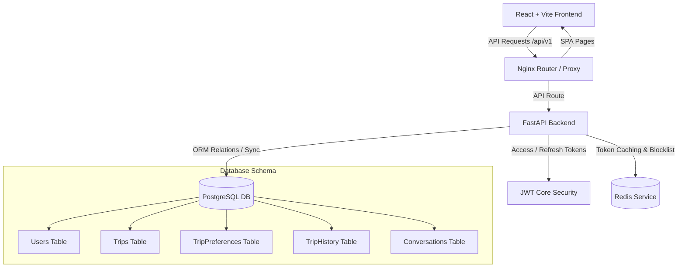

# TripGenie AI - Travel Platform Foundation

TripGenie AI is a production-grade, highly scalable AI-powered Travel Planning Platform. This repository contains the complete full-stack foundation, docker configurations, database models, schemas, routing, and high-fidelity responsive user interface.

---

## Architecture Blueprint



---

## Directory Structure

```text
tripgenie-ai/
├── docker-compose.yml          # Container configuration (Postgres, Redis, Backend, Frontend)
├── .env.example                # App settings configurations variables
└── README.md                   # Platform documentation
├── backend/
│   ├── Dockerfile              # Production Python multi-stage container
│   ├── requirements.txt        # Backend dependencies
│   ├── alembic.ini             # DB migrations config
│   ├── alembic/                # Migration scripts
│   └── app/
│       ├── main.py             # FastAPI App entrypoint
│       ├── core/               # Security, Database Engines, Pydantic Config
│       ├── models/             # SQLAlchemy Table Declarations (Users, Trips, Chats, Feedback)
│       ├── schemas/            # Pydantic request/response schemas
│       ├── crud/               # Database repositories & queries
│       └── api/                # Endpoints (Auth, Users, Trips, Chats, Feedback)
└── frontend/
    ├── Dockerfile              # Multi-stage Nginx-served static builder
    ├── nginx.conf              # SPA subroutes server settings
    ├── package.json            # NPM dependencies
    ├── tsconfig.json           # Type configurations
    ├── tailwind.config.js      # CSS Theme extensions
    └── src/
        ├── main.tsx            # React mounting
        ├── App.tsx             # Theme & Query wrapper
        ├── index.css           # HSL design tokens & gradients
        ├── components/
        │   ├── ui/             # Reusable custom Shadcn primitives (Button, Card, Input, Tabs)
        │   ├── layout/         # Shell framework (Sidebar, Navbar, DashboardLayout)
        │   └── theme/          # Dark/Light provider
        ├── pages/              # Responsive templates (Dashboard, Login, Profile, Settings)
        └── services/           # Axios interceptors & auto token refreshes
```

---

## Database Schemas

The PostgreSQL database houses the following tables managed via **SQLAlchemy**:

1. **`users`**: Core account details, credentials, and profile image locations.
2. **`trips`**: General trip definitions including budget boundaries, title, and status.
3. **`trip_preferences`**: Specific traveler choices (accommodation style, pace, dietary guidelines) mapped 1:1 to a Trip.
4. **`saved_trips`**: Bookmarks linking user accounts to trip plans.
5. **`trip_history`**: Audit logs containing JSON metadata of edits made to a trip.
6. **`conversations`**: Chat thread sessions connecting users to the AI travel advisor.
7. **`messages`**: Individual messages (user vs assistant) mapping history inside a conversation.
8. **`notifications`**: User alert entries (system alerts, flight drop notifications) shown in the header.
9. **`feedback`**: Submissions rating the platform performance with comments.

---

## Getting Started

### 1. Docker Compose (Quickest)

You can launch the entire stack including the databases, caching, frontend, and backend instantly using Docker:

```bash
# Clone and spin up containers
docker compose up --build
```
- **Frontend App**: `http://localhost:5173`
- **Backend API Docs (Swagger)**: `http://localhost:8000/docs`

---

### 2. Manual Local Setup

#### A. Backend (FastAPI)
1. Navigate to the backend folder:
   ```bash
   cd backend
   ```
2. Initialize virtual environment:
   ```bash
   python -m venv .venv
   .venv\Scripts\activate  # Windows
   source .venv/bin/activate  # macOS/Linux
   ```
3. Install packages:
   ```bash
   pip install -r requirements.txt
   ```
4. Copy the environment variables:
   ```bash
   copy .env.example .env
   ```
5. Launch FastAPI development server:
   ```bash
   uvicorn app.main:app --reload
   ```

#### B. Frontend (React + Vite)
1. Navigate to the frontend folder:
   ```bash
   cd ../frontend
   ```
2. Install npm dependencies:
   ```bash
   npm install
   ```
3. Run Vite dev server:
   ```bash
   npm run dev
   ```

---

## Production Deployment Checklist & Guide

The codebase is fully primed and structured for deployment using Docker, container orchestration (such as Kubernetes or ECS), or traditional VM environments.

### 1. Zero-Configuration Database Schema Init
* **Automatic PostgreSQL Provisioning**: The backend [database.py](file:///C:/Users/mahak/.gemini/antigravity-ide/scratch/tripgenie-ai/backend/app/core/database.py) automatically provisions all schema tables on the first incoming API request (using `Base.metadata.create_all`). No manual migrations or SQL queries are required when initializing a clean database.
* **Seeding Preset Trips**: You can seed the production database with initial localized itineraries by running:
  ```bash
  docker compose exec backend python seed_indian_trips.py
  ```

### 2. Docker Compose Deployment (Single Command)
Deploy the entire production stack (PostgreSQL, Redis, Nginx static host, and FastAPI Uvicorn API server) using Docker:
```bash
docker compose up -d --build
```
* **Reverse Proxy Integration**: The frontend container runs a lightweight **Nginx** server listening on port `5173`. It handles client-side SPA routing (`try_files`) and automatically proxies `/api/*` endpoints to the backend container, eliminating CORS configuration issues at the network level.

### 3. Production Variables Setup (.env)
Before pushing to production, rename `.env.example` to `.env` in the server root and configure:
* **`JWT_SECRET_KEY`**: Set to a cryptographically secure random string (`openssl rand -hex 32`).
* **`DATABASE_URL`**: Update connection URI to point to your managed database service (e.g., AWS RDS, Cloud SQL).
* **`REDIS_URL`**: Point to your managed Redis cache cluster (e.g., ElastiCache, Memorystore).
* **`FRONTEND_URL`**: Set the public canonical URL of your client app (for OAuth redirects and security guards).

### 4. Build and Compilation Validation
* **Backend Build**: Clean compilation validated in Python 3.11 builder image environment.
* **Frontend Bundle**: Production build runs `tsc && vite build`, creating highly minified, cache-busted index files ready to be served from `/usr/share/nginx/html` in Nginx.

